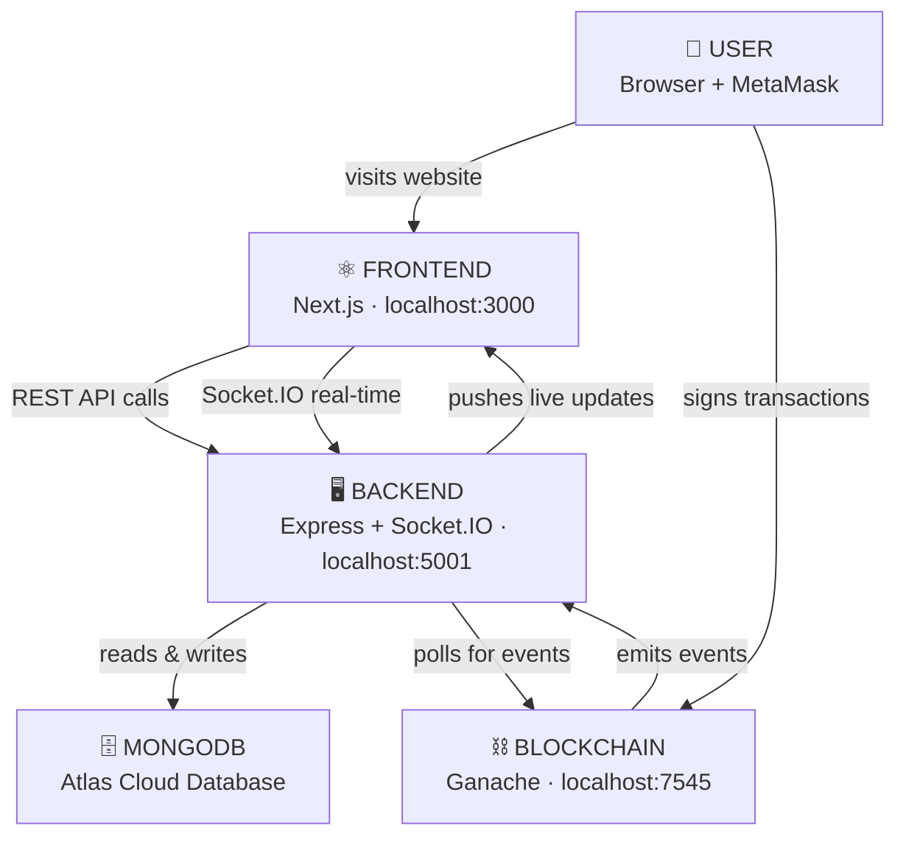
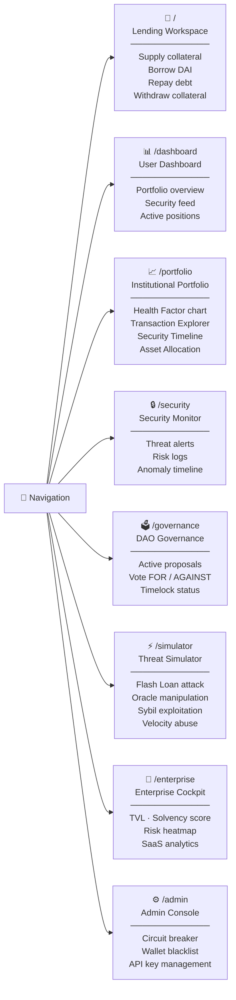
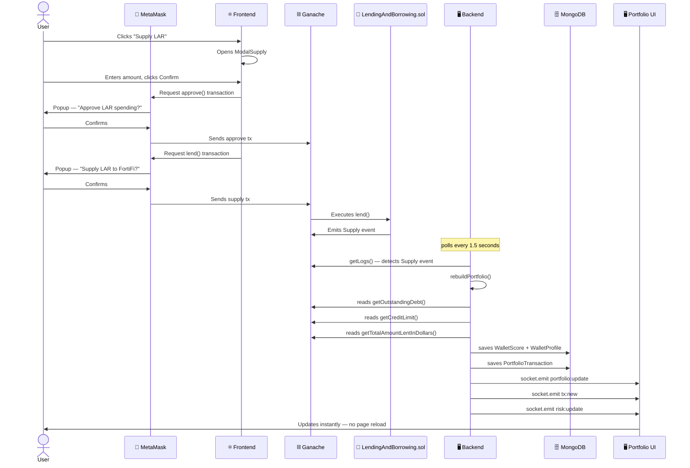
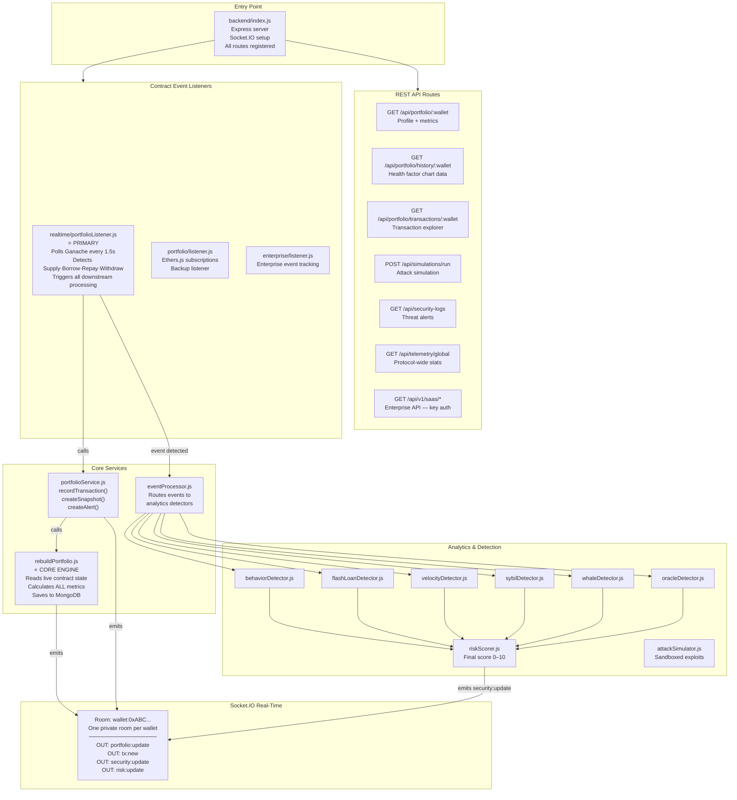
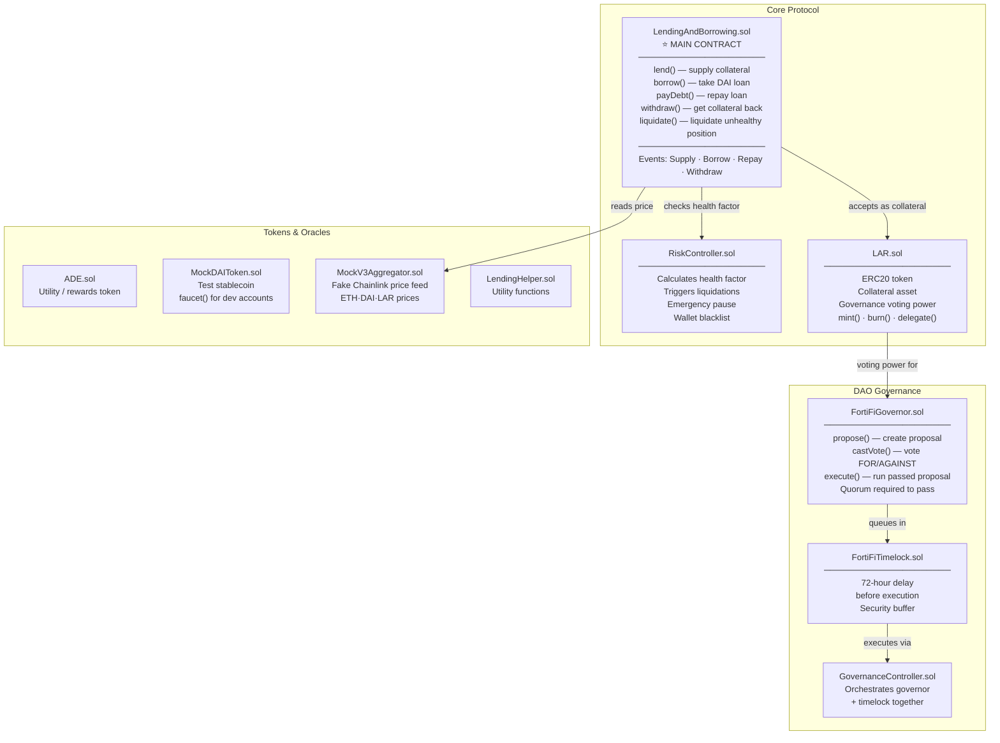
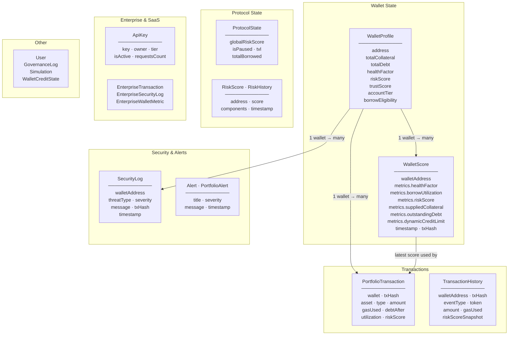
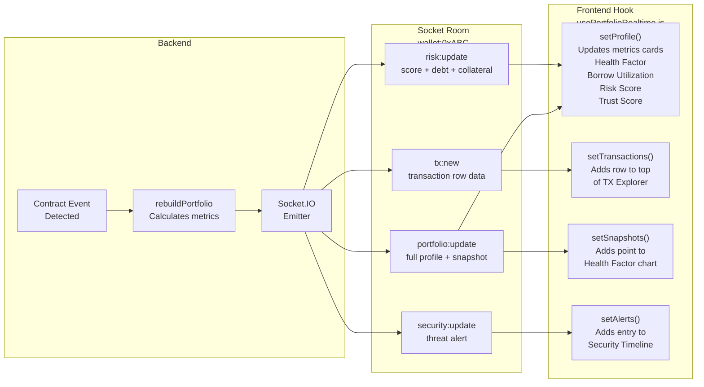
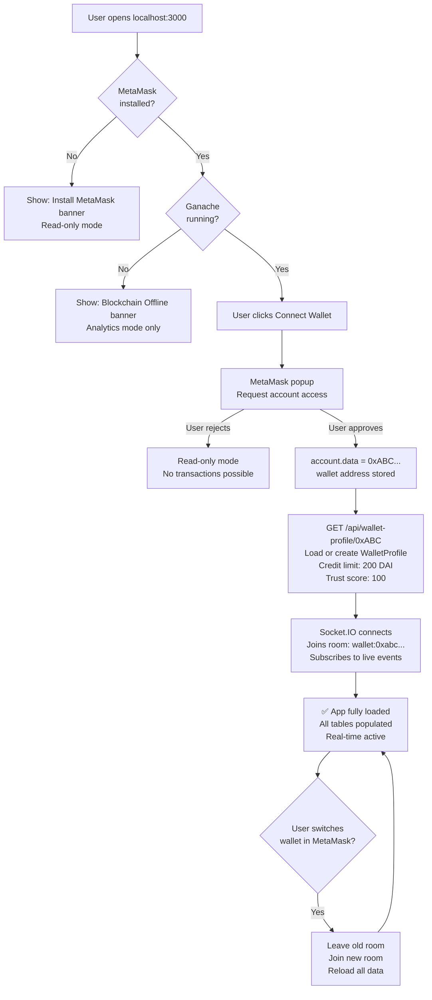

# FortiFi — System Architecture

## DIAGRAM 1 — Big Picture (How Everything Connects)

---

## DIAGRAM 2 — Frontend Pages & What Each Does

---

## DIAGRAM 3 — Transaction Flow (Supply Example, Step by Step)

---

## DIAGRAM 4 — Backend Internal Architecture

---

## DIAGRAM 5 — Smart Contracts on Blockchain

---

## DIAGRAM 6 — Database Collections (MongoDB)

---

## DIAGRAM 7 — Real-Time Socket Flow

---

## DIAGRAM 8 — MetaMask & Wallet Connection Flow

---

## SUMMARY TABLE

| Layer | Technology | Port | Responsibility |
|---|---|---|---|
| 👤 User | Browser + MetaMask | — | Interacts with UI, signs transactions |
| ⚛️ Frontend | Next.js + React | 3000 | 8 pages, hooks, real-time state |
| 🖥️ Backend | Express + Socket.IO | 5001 | API, event listeners, analytics |
| 🗄️ Database | MongoDB Atlas | cloud | Stores all wallet + protocol data |
| ⛓️ Blockchain | Ganache + Solidity | 7545 | Executes transactions, emits events |

| Key Flow | Path |
|---|---|
| User does transaction | MetaMask → Ganache → Contract → Event |
| Event reaches backend | portfolioListener polls every 1.5s |
| Metrics calculated | rebuildPortfolio reads live contract state |
| Data saved | WalletScore + WalletProfile → MongoDB |
| UI updates | Socket.IO → usePortfolioRealtime → React state |
| No page reload needed | Everything via socket events |
