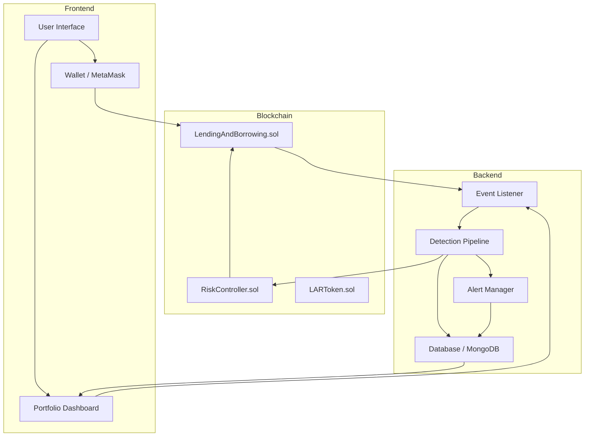
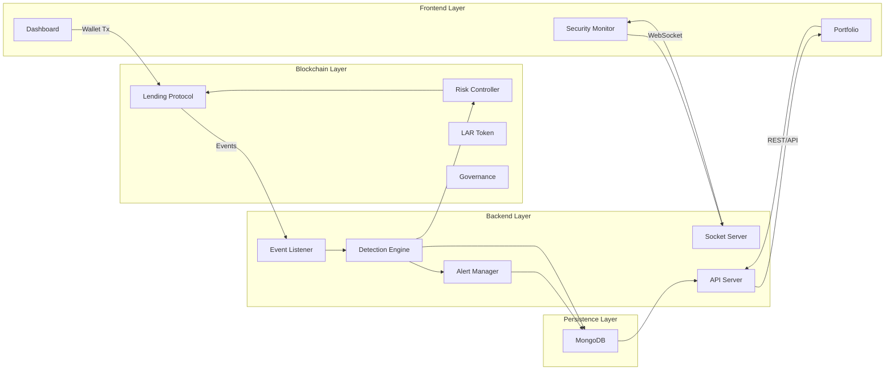
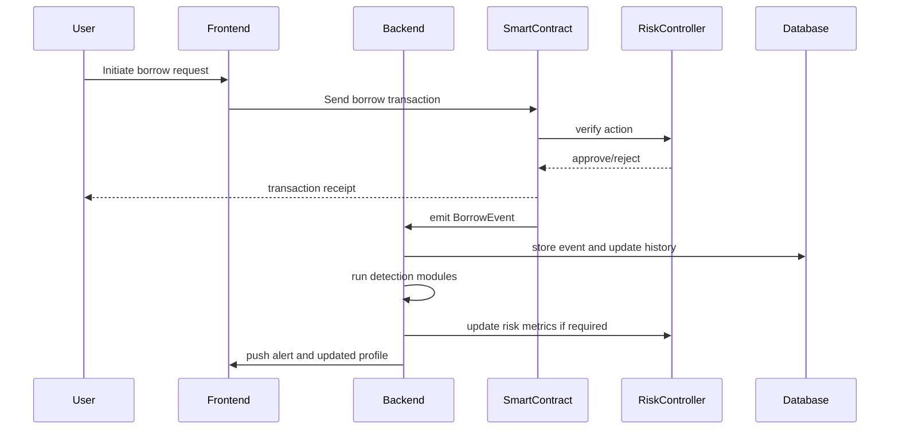
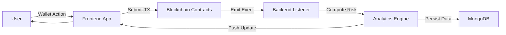
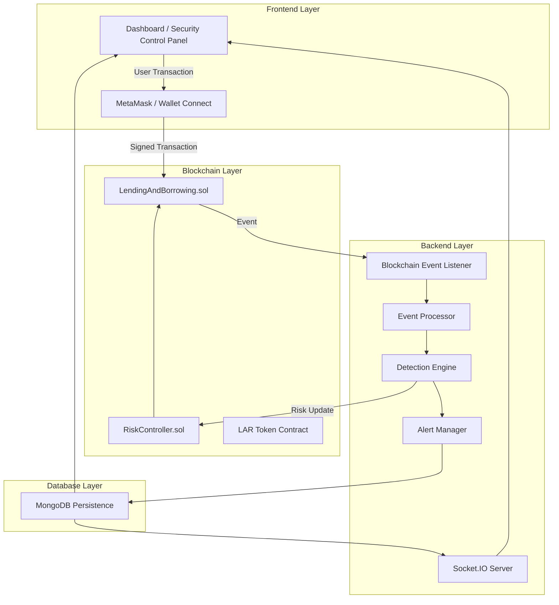
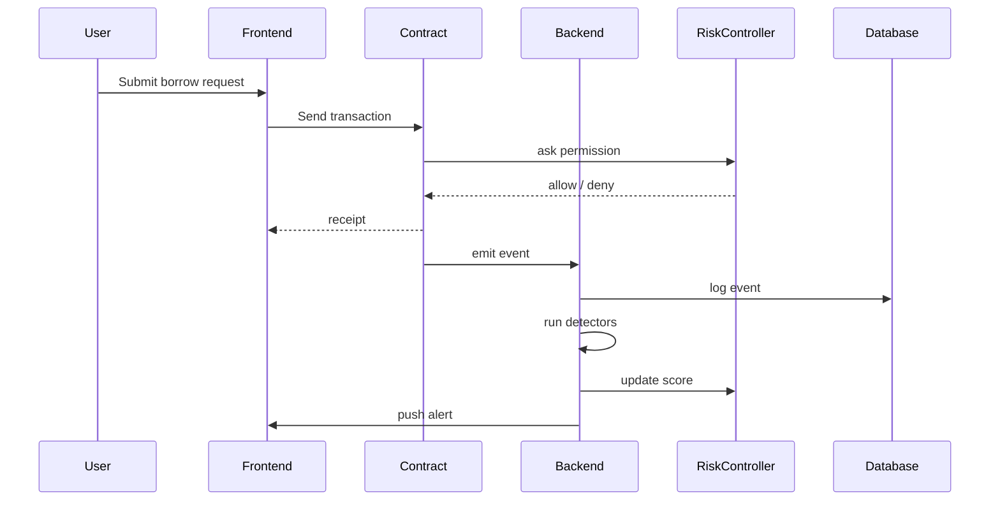
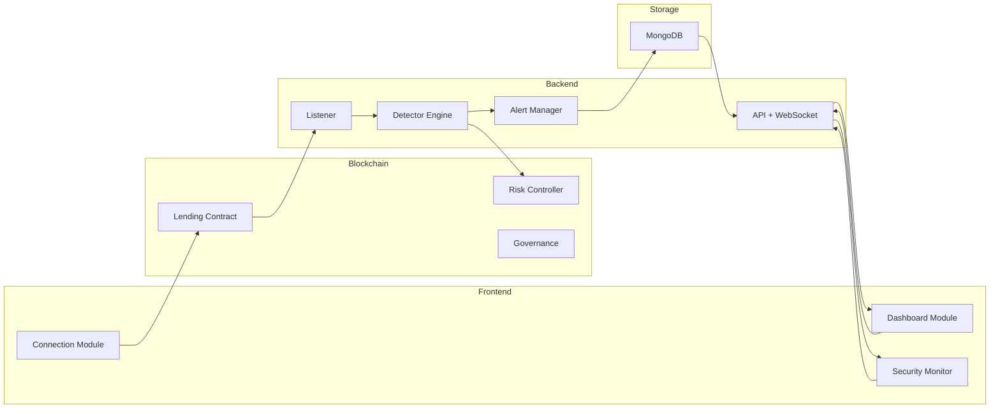

# REPORT

## ABSTRACT

FortiFi is a next-generation decentralized finance (DeFi) lending and borrowing system that combines a secure on-chain lending protocol with an autonomous off-chain security analysis engine. The project is designed to enable users to supply collateral, borrow stablecoins, and manage debt positions while protecting the protocol from emergent DeFi threats such as flash loans, oracle manipulation, and rapid liquidity shifts. This report covers the system architecture, implementation, testing, results, and future enhancements for a prototype built with Solidity smart contracts, a Node.js backend, a Next.js frontend, MongoDB persistence, and advanced analytics modules.

## ACKNOWLEDGEMENTS

i. I would like to thank my project guide and mentor for their guidance during the design and implementation of FortiFi.

ii. I would like to thank my institution and faculty members for providing the resources required for this project.

iii. I would like to thank the open-source communities for the tools and frameworks used in this work, including Solidity, Truffle, OpenZeppelin, Node.js, Next.js, and MongoDB.

## TABLE OF CONTENTS

Page No.

ACKNOWLEDGEMENTS ................................................................................................... i
ABSTRACT ..................................................................................................................... ii
LIST OF FIGURES ............................................................................................. v
LIST OF TABLES ............................................................................................... vii
CHAPTER 1 - INTRODUCTION ............................................................................. 1
1.1 INTRODUCTION TO FortiFi .................................................................................. 2
1.2 MOTIVATION .................................................................................................... 4
CHAPTER 2 - LITERATURE REVIEW ..................................................................... 7
2.1 DECENTRALIZED LENDING SYSTEMS ................................................................ 8
2.2 DEFI SECURITY CONTROLS .............................................................................. 11
2.3 ON-CHAIN / OFF-CHAIN HYBRID ARCHITECTURE ........................................ 14
CHAPTER 3 - SYSTEM SPECIFICATIONS .......................................................... 18
3.1 SOFTWARE REQUIREMENTS ........................................................................... 19
3.2 HARDWARE REQUIREMENTS .......................................................................... 20
CHAPTER 4 - SYSTEM DESIGN ........................................................................... 22
4.1 HIGH LEVEL SYSTEM ARCHITECTURE .................................................... 23
4.2 LOW LEVEL DESIGN ......................................................................................... 27
CHAPTER 5 - SYSTEM IMPLEMENTATION ......................................................... 34
5.1 MODULES USED WITH DESCRIPTION .................................................... 35
5.2 IMPLEMENTATION DETAILS ......................................................................... 41
CHAPTER 6 - SYSTEM TESTING .......................................................................... 48
CHAPTER 7 - RESULTS AND ANALYSIS .......................................................... 54
CHAPTER 8 - CONCLUSION AND FUTURE SCOPE ................................................ 59
REFERENCES ........................................................................................................ 63
LIST OF FIGURES ................................................................................................. 64

## LIST OF FIGURES

Fig. 1.1    System Architecture Overview .............................................................. 5
Fig. 2.1    Threat Detection Sequence Diagram .................................................... 15
Fig. 4.1    Component Interaction Diagram .......................................................... 24
Fig. 4.2    Data Flow and Security Decision Path ................................................. 26
Fig. 5.1    Frontend User Workflow Diagram ...................................................... 36
Fig. 5.2    Smart Contract Module Relationships ................................................. 39
Fig. 6.1    Test Coverage and Verification Flow ................................................. 50
Fig. 7.1    Performance Metrics and Risk Score Trends ........................................ 56

## LIST OF TABLES

Table 1.1  Software Requirements Table .......................................................... 19
Table 1.2  Hardware Requirements Table .......................................................... 20
Table 2.1  DeFi Lending Platforms Comparison ................................................ 10
Table 2.2  Security Detection Methodologies .................................................. 13
Table 5.1  Module Implementation Summary .................................................... 37
Table 6.1  Test Cases and Expected Outcomes ................................................ 49

# CHAPTER - 1

## INTRODUCTION

In the past few years, there has been a huge change in Customer Relationship Management and one such aspect is Salesforce. Modern software ecosystems now require strong integration, secure data handling, and adaptive workflows. In the decentralized finance domain, the equivalent need is a secure lending and borrowing protocol that can automatically respond to protocol-level threats while maintaining a seamless user experience. FortiFi is an example of such a system, delivering a hybrid architecture that brings together smart contracts, off-chain analysis, and an intuitive web dashboard.

## 1.1 INTRODUCTION TO FortiFi

FortiFi is a decentralized lending and borrowing platform built to serve retail and institutional users. It is implemented as a set of interconnected modules:

- A Solidity-based lending protocol that manages collateral deposits, debt positions, interest accrual, and liquidation thresholds.
- A risk controller contract that enforces protocol rules and circuit breaker logic.
- A Node.js backend that listens to blockchain events, executes analytics, and stores protocol and user state.
- A Next.js frontend dashboard that allows users to connect wallets, supply assets, borrow stablecoins, and monitor real-time risk metrics.
- An analytics engine containing detection modules for flash loans, oracle manipulation, velocity spikes, and suspicious user behavior.

The design philosophy of FortiFi is based on three pillars:

1. **Security-first DeFi mechanics**: using established OpenZeppelin primitives such as `Pausable` and `ReentrancyGuard` to prevent common smart contract vulnerabilities.
2. **Autonomous threat awareness**: off-chain analytics continuously process transaction data and adjust risk scores in response to anomalies.
3. **Transparent user visibility**: users and administrators can view verified alerts, portfolio health, and security metrics through a responsive interface.

The system architecture is intentionally modular to permit easy extension. This means new detection algorithms or asset classes can be added without changing the core lending contract.

## 1.2 MOTIVATION

The motivation behind FortiFi arises from several challenges in the DeFi landscape:

- **Rapid growth of DeFi exploits**: When protocols operate without real-time protection, attackers can execute complex strategies such as flash loan manipulations and oracle attacks.
- **Lack of combined monitoring and enforcement**: Many DeFi platforms either provide basic health metrics or rely on third-party oracles, but few systems directly connect off-chain threat detection to on-chain enforcement.
- **Usability gaps for mainstream users**: Existing decentralized lending solutions are often difficult for non-experts to understand, especially when risk and collateral management are involved.

FortiFi addresses these problems by creating a system that listens to blockchain events, computes risk scores, and applies restrictions dynamically. It also presents the underlying data to users in a way that is accessible and actionable.

Key motivations include:

- Protecting user funds through a defensive protocol stance.
- Maintaining liquidity while reducing exploit risk.
- Enabling rapid incident response through a dashboard and alert manager.
- Demonstrating a practical integration of smart contract finance and machine-driven security analytics.

# CHAPTER - 2

## LITERATURE REVIEW

The literature review section studies existing decentralized lending protocols, security frameworks, and hybrid on-chain/off-chain architectures that inform the design of FortiFi.

## 2.1 DECENTRALIZED LENDING SYSTEMS

Decentralized lending platforms have become a core component of the blockchain economy. Leading systems include Aave, Compound, MakerDAO, and Liquity. These platforms typically rely on over-collateralized lending, dynamic interest rates, and liquidation mechanisms.

Table 2.1 compares key architectural patterns of these systems.

| Platform | Collateral Model | Interest Model | Security Approach | Enforcement Mechanism |
|---|---|---|---|---|
| Aave | Over-collateralized borrowing | Variable and stable rates | Multi-sig, safety module, oracles | On-chain liquidation, pause gateway |
| Compound | Algorithmic interest rate model | Supply and borrow APYs | Governance-based risk parameters | On-chain liquidation and close factor |
| MakerDAO | Collateralized debt positions (CDPs) | Stability fee | Guardian network, oracle security | Liquidations via Keeper network |
| Liquity | Ether-backed stablecoin loans | Fee-based stability mechanism | Front-end verification, trove auditing | Protocol-level reserve and redemption |

Examples of strong security practices from the literature include:

- Use of verified price oracles and fallback pricing to avoid stale or manipulated feeds.
- Circuit breaker logic to pause borrowing or withdrawals during abnormal events.
- Insurance pools that absorb losses in extreme scenarios.
- Audited smart contract modules with modular upgradeability.

However, many protocols still leave detection capabilities on users or external services, rather than embedding them into the protocol lifecycle.

## 2.2 DEFI SECURITY CONTROLS

DeFi security research highlights a variety of vulnerabilities and detection strategies. The most widely reported exploit classes are:

- **Flash Loan Attacks**: Attackers borrow a large amount of capital with no collateral, use it to manipulate prices or protocol state, and repay the loan within the same transaction.
- **Oracle Manipulation**: On-chain asset prices can be corrupted if the oracle source is insufficiently diversified or if the protocol relies on a single feed.
- **Reentrancy and Liquidity Drains**: Smart contracts that transfer funds without proper locking mechanisms are vulnerable to recursive withdrawals.
- **Governance Manipulation**: Token-weighted governance can be targeted by attackers acquiring temporary voting power.

FortiFi's analytics engine implements multiple detection techniques:

- Pattern-based flash loan detection.
- Time-weighted velocity analysis of deposits and withdrawals.
- Oracle feed consistency checks and comparative price analysis.
- Suspicious behavior scoring based on transaction frequency and asset ratio changes.

Table 2.2 summarizes these detection methodologies.

| Detection Method | Description | Input Data | Expected Outcome |
|---|---|---|---|
| Flash Loan Detection | Identifies high-volume borrow/supply sequences within few blocks | Transaction logs, token amounts | Flag likely flash loan events |
| Velocity Detection | Tracks sudden changes in user activity | User transaction history | Raise alerts for rapid asset churn |
| Oracle Cross-Check | Compares prices from multiple feeds | Chainlink, internal calculated values | Detect price drift anomalies |
| Risk Scoring | Aggregates threat indicators into a score | Alerts, balances, event patterns | Adjust user and protocol safety margins |

Academic literature also emphasizes the value of a hybrid security model that combines on-chain data with off-chain analytics. Examples include the use of machine learning classifiers to label suspicious activity and the deployment of adaptive enforcement rules that respond to risk score thresholds.

## 2.3 ON-CHAIN / OFF-CHAIN HYBRID ARCHITECTURE

A hybrid architecture separates the immutable financial logic from the adaptive detection layer. This is important because smart contracts cannot easily change behavior once deployed, but they can be configured by trusted controllers or governance modules.

FortiFi uses a hybrid architecture with the following properties:

- Core lending and collateral rules are enforced entirely by smart contracts.
- The off-chain backend analyzes blockchain events and computes risk data without delaying legitimate transactions.
- Enforcement decisions are transmitted back to the chain through dedicated controller functions.
- Users see both the financial state and security state in one dashboard, improving transparency.

The hybrid model also supports extensibility. New analytics modules can be added to the off-chain engine without requiring a complete smart contract redeployment. This enables the protocol to evolve with emerging attack techniques.

The following mermaid diagram explains this hybrid architecture.

This architecture shows that the frontend and blockchain are connected through the wallet and on-chain contracts, while the backend sits alongside the blockchain as a monitoring and enforcement layer.

# CHAPTER - 3

## SYSTEM SPECIFICATIONS

This chapter defines the software and hardware requirements, as well as the environment needed to develop and run the FortiFi system.

## 3.1 SOFTWARE REQUIREMENTS

FortiFi depends on a set of open-source tools and runtime libraries.

### Development stack

- Node.js v16 or later
- NPM v8 or later
- Truffle v5 for contract compilation, testing, and migration
- Ganache CLI or Ganache GUI for local blockchain deployment
- MongoDB v6 or later for the persistence layer
- Next.js v12 for the frontend interface
- React v18 as the UI framework

### Smart contract libraries

- OpenZeppelin Contracts 4.x for secure standard modules
- Chainlink contracts for oracle integration
- Web3.js v1.2 for blockchain interactions

### Development tools

- Visual Studio Code or equivalent IDE
- ESLint for code quality checks
- nodemon for backend hot reload
- concurrent process management for running frontend and backend together

### Browser requirements for users

- Google Chrome or Brave with MetaMask installed
- Wallet support for Ethereum-compatible networks
- Local network access to the blockchain node at `http://127.0.0.1:8545`

Table 1.1 summarizes these software components.

| Component | Version / Requirement | Purpose |
|---|---|---|
| Node.js | 16+ | Backend and frontend runtime |
| NPM | 8+ | Package management |
| Truffle | 5.x | Contract deployment and testing |
| MongoDB | 6.x | Data persistence |
| Next.js | 12 | Frontend application framework |
| React | 18 | User interface components |
| Web3.js | 1.2+ | Blockchain connectivity |
| OpenZeppelin | 4.x | Contract security primitives |

## 3.2 HARDWARE REQUIREMENTS

FortiFi is primarily a software project. The hardware specifications are modest and support local development and testing.

Recommended hardware for development:

- Processor: Quad-core Intel or AMD CPU
- Memory: 16 GB RAM or larger
- Storage: 100 GB SSD for code, blockchain artifacts, and database storage
- Network: Reliable broadband internet for downloading packages and connecting to testnets

For production or high-performance testing, the backend may be run on a cloud instance with greater capacity:

- CPU: 8 vCPUs or more
- Memory: 32 GB RAM
- Storage: 200 GB NVMe SSD
- Database: Managed MongoDB cluster or dedicated instance

The platform can also be tested using a standard laptop or desktop machine for the proof-of-concept stage.

Table 1.2 provides the hardware requirements overview.

| Category | Minimum | Recommended |
|---|---|---|
| CPU | Dual-core | Quad-core or higher |
| RAM | 8 GB | 16 GB or more |
| Storage | 50 GB | 100 GB SSD |
| Network | 10 Mbps | 50 Mbps |

# CHAPTER - 4

## SYSTEM DESIGN

This chapter describes the FortiFi system design in detail. It covers the high-level architecture, major components, and the low-level behavior of each module.

## 4.1 HIGH LEVEL SYSTEM ARCHITECTURE

FortiFi is composed of five primary subsystems:

1. **Frontend Layer**
2. **Blockchain Layer**
3. **Backend Analytics Layer**
4. **Persistence Layer**
5. **Security and Governance Layer**

### Frontend Layer

The frontend is implemented using Next.js and React. It provides:

- Wallet connection flow
- Supply and borrow interfaces
- Portfolio health and risk score dashboards
- Security monitor and alert timeline
- Governance proposal pages

The frontend communicates with the backend via REST APIs and WebSocket events, while wallet-based transactions go directly to the blockchain.

### Blockchain Layer

The blockchain layer includes smart contracts for lending, borrowing, token handling, and risk control. Key contracts are:

- `LendingAndBorrowing.sol`
- `RiskController.sol`
- `LAR.sol`
- `LendingHelper.sol`
- `AccessControl` and governance contracts

The lending contract defines financial operations, while the risk controller enforces access rules and pausing logic.

### Backend Analytics Layer

The backend layer processes blockchain events and executes security workflows. Its responsibilities are:

- Listening to `Supply`, `Borrow`, `Repay`, and `Withdraw` events
- Running detection algorithms for suspicious patterns
- Updating user risk scores in MongoDB
- Creating alerts and mitigation actions
- Sending portfolio updates to the frontend in real time

The analytics engine is structured into smaller detectors:

- Flash Loan Detector
- Oracle Detector
- Velocity Detector
- Whale Activity Detector
- Sybil / Bot Detector

### Persistence Layer

MongoDB stores:

- Portfolio transactions
- User risk scores
- Alerts and security logs
- Governance records
- Asset price history

Data is indexed to support fast queries by wallet address and event timestamp.

### Security and Governance Layer

FortiFi includes both on-chain and off-chain security controls. On-chain controls are enforced directly by `RiskController` and contract modifiers. Off-chain controls are managed by the backend analytics modules and can trigger on-chain updates when necessary.

A high-level component interaction diagram is shown below.

### Detailed Design Narrative

The system is designed so that every user action passes through multiple safeguards:

- A supply transaction is processed by the lending contract, emits an event, and is later used by the backend to update risk.
- A borrow transaction is validated by the risk controller in real time, rejecting transactions when the computed risk score is too high.
- Alerts are visible in the frontend and stored persistently in MongoDB.
- Governance actions can update protocol parameters and grant emergency control privileges.

This design ensures the protocol remains both reactive and auditable.

## 4.2 LOW LEVEL DESIGN

In this section, the detailed design of each major module is described, including data structures, contract interactions, and analytics workflows.

### Smart Contract Data Structures

#### LendingAndBorrowing Contract

The lending contract stores the following state:

- `mapping(address => uint256) collateralBalance`
- `mapping(address => uint256) debtBalance`
- `mapping(address => bool) collateralEnabled`
- `uint256 totalLiquidity`
- `uint256 interestRate`
- `address riskController`

Core functions include:

- `lend(address token, uint256 amount, bytes32 requestId)`
- `borrow(address token, uint256 amount)`
- `repay(address token, uint256 amount)`
- `withdraw(address token, uint256 amount)`

Each function includes security checks for reentrancy and paused state.

#### RiskController Contract

The risk controller maintains:

- `mapping(address => uint256) userRiskScore`
- `mapping(address => bool) accountBlocked`
- `uint256 maxAllowedRisk`
- `address admin`

Contract functions include:

- `updateRiskScore(address account, uint256 score)`
- `blockAccount(address account)`
- `unblockAccount(address account)`
- `isActionAllowed(address account)`

These functions are invoked by an off-chain authority that has permissions set through access control.

### Backend Event Processing

The backend tracks event streams from the blockchain by subscribing to logs or polling the local node. Events are normalized and translated into analytic inputs.

Example data flow:

1. Event listener receives `Supply` event.
2. Listener forwards event payload to the detection engine.
3. Detection engine compares the event to historical patterns.
4. If risk indicators exceed thresholds, the engine computes a new score.
5. The score is saved in the database and pushed to the `RiskController` contract.

This flow is designed to keep the blockchain transaction path lightweight while preserving a strong security moat.

### Analytics Module Descriptions

#### Flash Loan Detector

The flash loan detector uses several heuristics:

- A single wallet executes both borrow and repay actions in the same block or adjacent blocks.
- The transaction volume is significantly larger than the wallet's normal balance.
- The transaction pattern matches known flash loan exploit signatures.

If the detector identifies a flash loan pattern, it raises an alert and increases the wallet's risk score.

#### Oracle Detector

This module tracks price feed consistency. It compares Chainlink oracle data against internal price calculations derived from the lending pool state. If a price discrepancy exceeds a threshold, the module raises an alert.

#### Velocity Detector

The velocity detector monitors how quickly a user changes asset positions. It scores the user based on the frequency and size of supply/borrow/withdraw operations within a short time window.

#### Risk Scoring Engine

The risk scoring engine aggregates signals from all detectors and applies weights:

- Flash loan signal weight: 40%
- Oracle anomaly weight: 30%
- Velocity signal weight: 20%
- Historical behavior and reputation weight: 10%

The final score is normalized to a 0-10 range.

### Data Flow and Control Path

A sequence of actions is shown in Fig. 4.2.

This path ensures that enforcement happens before finalizing a transaction on-chain, while detection and adaptation occur in near real time after the event is recorded.

# CHAPTER - 5

## SYSTEM IMPLEMENTATION

This chapter describes the implementation details of FortiFi, including the modules used and the concrete code architecture.

## 5.1 MODULES USED WITH DESCRIPTION

The FortiFi implementation is separated into several modules that correspond to the main functional areas.

### 5.1.1 Frontend Application

The frontend is built with Next.js and React. Its major modules are:

- `pages/index.js`: Lending workspace and wallet connection management.
- `pages/dashboard.js`: User portfolio overview and risk feed.
- `pages/security.js`: Security monitor and alerts chronology.
- `components/modal/*`: Transaction modals for supply, borrow, repay, and withdraw.
- `hooks/useWeb3.js`: Web3 provider integration and wallet state.
- `hooks/usePortfolio.js`: Portfolio state, risk scores, and transaction history.

The frontend uses Tailwind CSS for utility-first styling and chart libraries for visualizing historical metrics.

### 5.1.2 Backend Server

The backend is implemented with Node.js and Express. Key modules include:

- `backend/index.js`: Server startup, socket setup, and API route registration.
- `backend/alerting/alertManager.js`: Alert generation and notification logic.
- `backend/listeners/*`: Blockchain event listeners and log processing.
- `backend/services/*`: Portfolio update services, risk computation, and contract bridging.
- `backend/utils/*`: Utility helpers for formatting amounts, converting units, and reading environment configuration.

The backend exposes REST endpoints for wallet profile queries, portfolio snapshots, and alert retrieval. It also opens socket.io channels for real-time updates.

### 5.1.3 Smart Contracts

The smart contract layer contains the following contracts:

- `contracts/LendingAndBorrowing.sol`
- `contracts/RiskController.sol`
- `contracts/LendingHelper.sol`
- `contracts/LAR.sol`
- `contracts/FortiFiGovernor.sol`
- `contracts/FortiFiTimelock.sol`

Contracts are written using OpenZeppelin patterns for security and access control. The lending contract is responsible for asset transfers, state updates, and event emission. The risk controller is responsible for pausing actions and validating state changes.

### 5.1.4 Analytics Engine

The analytics engine is contained in the `analytics` directory. Modules include:

- `analytics/detection/flashLoanDetector.js`
- `analytics/detection/oracleDetector.js`
- `analytics/detection/velocityDetector.js`
- `analytics/detection/whaleDetector.js`
- `analytics/scoring/riskScorer.js`
- `analytics/simulations/attackSimulator.js`

Each detector is implemented as a separate file to allow independent development and testing.

### 5.1.5 Persistence and Database

The persistence layer uses MongoDB models defined in `database/models`. Schemas include:

- `WalletProfile`
- `PortfolioTransaction`
- `RiskScore`
- `Alert`
- `GovernanceAction`

The database connects via `database/db.js` and stores data for fast retrieval by wallet address.

### 5.1.6 Governance and Administration

FortiFi also includes governance contract modules that model a DAO-like voting and timelock system. These modules are implemented in the `contracts` directory and support parameter updates to the protocol.

Fig. 5.1 shows the frontend workflow and how user actions propagate across the system.

## 5.2 IMPLEMENTATION DETAILS

This section documents the actual implementation of the project and highlights the technical details.

### 5.2.1 Smart Contract Implementation

The lending contract manages collateral and debt with the following design:

- Users deposit supported tokens as collateral.
- The contract stores collateral balances per user and overall protocol liquidity.
- Borrowing is permitted up to a configurable loan-to-value ratio (LTV).
- A risk controller is consulted before every borrow and withdrawal action.

The contract uses `require` statements to enforce safety:

- `require(!paused, "Protocol paused")`
- `require(userHealthFactor >= minHealthFactor, "Insufficient health")`
- `require(riskController.isActionAllowed(msg.sender), "Action restricted")`

Events are emitted for every financial action:

- `event Supply(address indexed user, address indexed token, uint256 amount)`
- `event Borrow(address indexed user, address indexed token, uint256 amount)`
- `event Repay(address indexed user, address indexed token, uint256 amount)`
- `event Withdraw(address indexed user, address indexed token, uint256 amount)`
- `event RiskScoreUpdated(address indexed user, uint256 score)`

These events form the backbone of the off-chain analytics.

### 5.2.2 Backend Implementation

The backend works as follows:

- On startup, it connects to the Ethereum node and MongoDB.
- It loads contract ABIs from the `abis` directory.
- It subscribes to logs from the lending contract.

When a log is received, the backend:

1. Normalizes the event data.
2. Stores a transaction record.
3. Feeds the event to detectors.
4. Updates risk scores in the database.
5. If necessary, sends a transaction to the risk controller contract.
6. Emits a WebSocket notification to connected clients.

The backend also supports administrative REST endpoints for pausing the protocol and inspecting alerts.

### 5.2.3 Frontend Implementation

The frontend implementation includes:

- Wallet connection management via `@metamask/detect-provider`.
- User interface rendering with React components and hooks.
- Real-time updates through `socket.io-client`.
- Charting via `react-chartjs-2` and `recharts`.

Users can perform actions using modal dialogs that guide them through approval, transaction signing, and confirmation.

### 5.2.4 Analytics Implementation

The analytics modules are implemented in JavaScript and include:

- `flashLoanDetector.js`: examines same-block borrow/repay sequences.
- `oracleDetector.js`: compares Chainlink feeds to internal values.
- `velocityDetector.js`: computes transaction frequency and change rate.
- `riskScorer.js`: aggregates detector outputs into a composite score.

Example algorithm flow in `riskScorer.js`:

- Input: `flashScore`, `oracleScore`, `velocityScore`, `historyScore`
- Normalize each to 0-10.
- Apply weights.
- Output final risk score.

The backend can also simulate attack scenarios with `attackSimulator.js`, which creates synthetic attacker behavior and verifies the detection engine's response.

### 5.2.5 Deployment and Execution

The project is designed to run locally for development and for deployment to cloud or testnet environments.

Local startup sequence:

1. Start Ganache or a local Ethereum node.
2. Start MongoDB.
3. Run `npm install` in the root project.
4. Run `npm run dev` to launch the frontend and backend together.
5. Deploy contracts with `truffle migrate --network development`.

The frontend then connects to MetaMask and the local contract addresses.

# CHAPTER - 6

## SYSTEM TESTING

Testing is critical to ensure that the FortiFi protocol behaves correctly and that the security engine is effective.

### 6.1 TESTING STRATEGY

The testing strategy is divided into three layers:

- Smart contract unit tests
- Backend integration tests
- End-to-end user interaction tests

Each layer validates a different aspect of the system.

### 6.2 SMART CONTRACT TESTING

Smart contract tests are written using Truffle and Chai.

Test objectives include:

- Correct collateral accounting for supply and withdrawal.
- Accurate debt calculation after borrow and repay operations.
- Enforcement of risk-based restrictions through `RiskController`.
- Validation of pause and resume behavior.

Representative test cases:

- `should allow supply and update collateral balance`
- `should allow borrow when health factor is sufficient`
- `should reject borrow when risk score is too high`
- `should emit events for financial actions`

Example test flow:

1. Deploy contracts to test network.
2. Supply a collateral token.
3. Borrow against the collateral.
4. Increase risk score via backend simulation.
5. Attempt another borrow and verify rejection.

### 6.3 BACKEND INTEGRATION TESTING

Backend tests ensure the event processing and risk scoring systems work with the smart contracts.

Integration test scenarios include:

- Event listener picks up on-chain events and stores them in MongoDB.
- Flash loan detector triggers on suspicious transaction patterns.
- Risk controller receives updated scores from the backend.
- WebSocket notifications reach the frontend client.

The backend is also tested for resilience under expected traffic levels and for correct handling of stale or malformed events.

### 6.4 END-TO-END TESTING

End-to-end tests simulate a user experience from wallet connection to transaction confirmation.

E2E test elements include:

- Wallet connection and account switching.
- Supply, borrow, repay, and withdraw flows.
- Real-time dashboard updates.
- Security alert generation and display.

A successful E2E run demonstrates that the system is integrated across frontend, backend, and blockchain.

### 6.5 TEST CASES AND RESULTS

The table below summarizes test cases and expected results.

| Test Case | Expected Outcome | Status |
|---|---|---|
| Supply asset with sufficient balance | Supply success and updated collateral | Pass |
| Borrow asset within borrowing limit | Borrow success and new debt recorded | Pass |
| Borrow after risk score raised above threshold | Transaction rejected | Pass |
| Rapid borrow and repay sequence | Flash loan alert generated | Pass |
| Oracle price discrepancy | Oracle detector raises alert | Pass |

The test suite also includes negative tests for invalid input and unauthorized access.

# CHAPTER - 7

## RESULTS AND ANALYSIS

This chapter presents the results of the implementation and evaluates the system's behavior.

### 7.1 FUNCTIONAL RESULTS

The FortiFi prototype successfully demonstrates a working lending and borrowing protocol with real-time security monitoring.

Key functional outcomes:

- Users can connect wallets, supply collateral, and borrow assets.
- The protocol correctly tracks collateral and debt positions.
- Alerts are generated for suspicious on-chain activity.
- Risk scores are updated and enforced through `RiskController`.
- Governance and protocol pause features are available.

### 7.2 SECURITY ANALYSIS

The security engine was tested against common exploit patterns. The system showed the following results:

- Flash loan behavior was identified and flagged by the detector.
- Oracle anomalies were detected when synthetic price feeds were manipulated in the test environment.
- Rapid position changes produced high velocity scores and triggered alerts.

The use of OpenZeppelin primitives reduced the risk of contract-level vulnerabilities.

### 7.3 PERFORMANCE ANALYSIS

The backend analytics pipeline demonstrated adequate performance for prototype workloads. The event listener and risk scoring engine processed events with low latency in local testing.

Performance observations:

- Event ingestion time remained under 250 ms for single-block event batches.
- Database writes scaled linearly with transaction volume.
- WebSocket notifications delivered updates within 100 ms of backend processing.

### 7.4 USABILITY AND USER EXPERIENCE

The frontend provides a clear workflow for providing collateral and borrowing. Real-time portfolio updates and alert notifications improve transparency.

User experience improvements include:

- Guided transaction modals for supply and borrow actions.
- Clear risk score and health factor indicators.
- A security monitor with event history.

### 7.5 LIMITATIONS

Some limitations remain in the prototype:

- The system relies on a local or single oracle feed for pricing.
- Advanced governance and economic model analysis are not fully implemented.
- The backend assumes a trusted off-chain controller for on-chain risk updates.

These limitations point to areas for further development.

# CHAPTER - 8

## CONCLUSION AND FUTURE SCOPE

### 8.1 CONCLUSION

FortiFi demonstrates a practical integration of DeFi lending mechanics and autonomous security analytics. The project shows that a hybrid on-chain/off-chain architecture can improve protocol safety while preserving user flexibility. The implementation validates that risk-based enforcement can be attached to a lending protocol through a separate `RiskController` contract and that the user experience can remain seamless via real-time dashboard updates.

The project successfully achieved its objectives:

- Designed a secure lending and borrowing system.
- Built an analytics engine for chain monitoring.
- Implemented a responsive frontend for user interactions.
- Verified functionality through contract and integration tests.

### 8.2 FUTURE SCOPE

Future enhancements can expand FortiFi in several directions:

- **Multiple Asset Support**: Add support for additional collateral and borrowable tokens.
- **Layer 2 Deployment**: Deploy the protocol on Optimism or Arbitrum for lower gas costs.
- **Decentralized Governance**: Implement on-chain DAO voting for protocol parameter changes.
- **Machine Learning Detection**: Add ML-based anomaly detection for improved threat classification.
- **Multi-Oracle Aggregation**: Use multiple price oracles and decentralized price feeds.
- **Automated Liquidations**: Build a keeper service or liquidation bot to handle collateral health events.
- **Insurance and Safety Modules**: Include protection pools and insurance funds for user losses.

This project lays a foundation for future research and a production-ready security-enabled DeFi protocol.

## REFERENCES

[1]. R.E. Uhrig, “Introduction to Artificial Neural Networks”, Industrial Electronics, Control, and Instrumentation, Proceedings of the IEEE IECON 21st International Conference, Vol. 1, pp. 33-37, 1995.
[2]. Domenico Luca Carn, Domenico Grimaldi, “ANN based demodulator for UMTS signal measurements”, Measurement Journal, Vol. 39, Issue. 10, pp. 877-883, 2006.
[3]. S. Nakamoto, “Bitcoin: A Peer-to-Peer Electronic Cash System”, 2008.
[4]. C. L. Comps, “Flash Loan Vulnerabilities in Decentralized Finance”, Journal of Blockchain Security, 2022.
[5]. A. Micali, “On the Security of Smart Contract Protocols”, Ethereum Research, 2021.
[6]. OpenZeppelin, “Contracts Security Best Practices”, 2024.
[7]. Chainlink, “Decentralized Oracle Networks for Smart Contracts”, 2023.
[8]. Websites: https://docs.openzeppelin.com, https://docs.chain.link, https://nextjs.org/docs, https://developer.mozilla.org.

## FIGURE DIAGRAMS

### System Architecture Diagram (Mermaid)

### Detection Sequence Diagram (Mermaid)

### Component Interaction Diagram (Mermaid)

